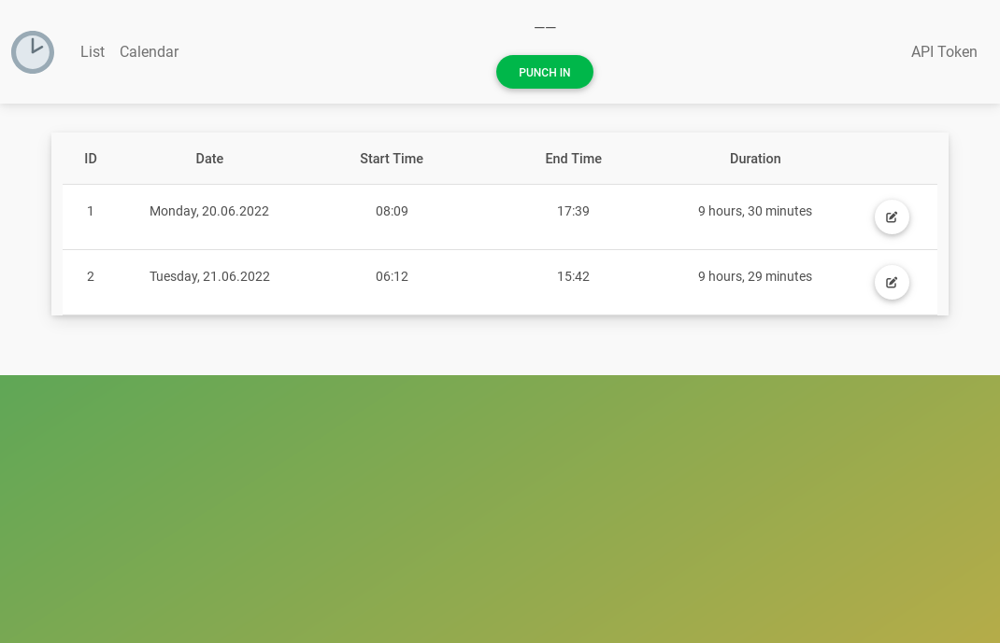
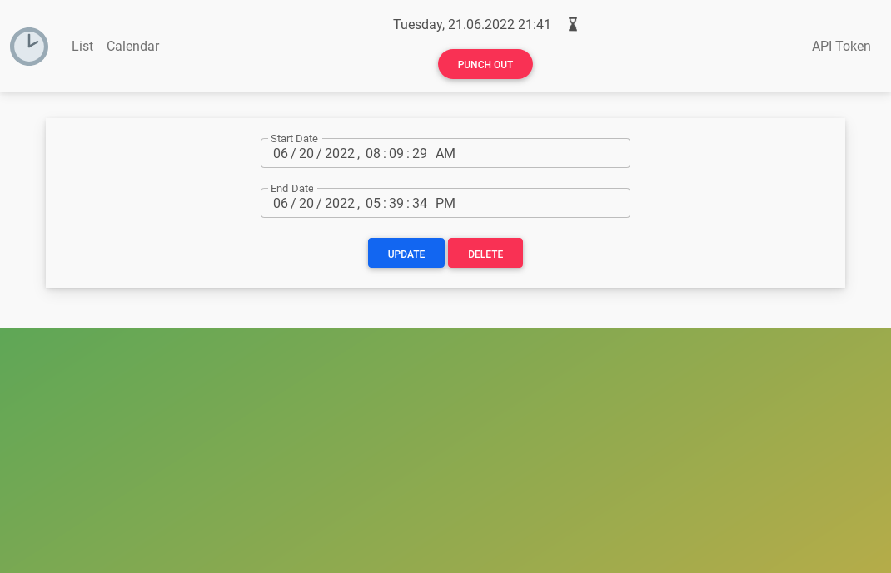

<div align="center">
  
  
  
  
  
  
  
  
</div>
  
# Table of Content
<details>
  <summary>Show</summary>
  
- [Table of Content](#table-of-content)
- [About](#about)
  - [Features](#features)
  - [Screenshots](#screenshots)
- [Configuration](#configuration)
  - [Application](#application)
  - [NGINX](#nginx)
- [Building](#building)
  - [Development](#development)
    - [Testing](#testing)
  - [Production](#production)
- [Usage](#usage)
  - [Development](#development-1)
  - [Production](#production-1)
  
</details>
  
# About
## Features

* WebUI
  * See logged hours in list view or calendar view.
  * Edit or remove existing entries.
  * Generate an API token to use the REST API.
  * Punch in or out directly from the WebUI.
  * Export monthly CSV files.
* REST API
  * One simple endpoint to punch in or out if already punched in (toggle): `/api/punch`.
  * BEARER authentication.

## Screenshots
<details>
  <summary>Show</summary>
  
* List View


* Calendar View


* Edit an entry


* Generate API Token

  
</details>

# Configuration
## Application
See the [development `env` file](.env.dev) or the [production `env` file](.env.prod) for available configurations.

## NGINX
If you want to use the productive Docker image, don't forget to check the [nginx.conf](nginx/nginx.conf) file and adapt it accordingly.
# Building
## Development
1. Build the image
```shell
$ docker compose -f docker-compose.dev.yml up --build
```
2. Add the initial admin user
```shell
$ docker compose -f docker-compose.dev.yml exec web python manage.py createsuperuser --username=admin --email=admin@example.com
```

### Testing
Run the available tests with
```shell
$ docker compose exec web python manage.py test
```

## Production
1. Build the image
```shell
$ docker compose -f docker-compose.prod.yml up --build
```
2. Create the database layout
```shell
$ docker compose -f docker-compose.prod.yml exec web python manage.py migrate --no-input
```
3. Collect the static files for nginx
```shell
$ docker compose -f docker-compose.prod.yml exec web python manage.py collectstatic --no-input --clear
```
4. Add the initial admin user
```shell
$ docker compose -f docker-compose.prod.yml exec web python manage.py createsuperuser --username=admin --email=admin@example.com
```

# Usage
## Development

Visit the website under http://127.0.0.1:8000.

## Production

Visit the website under http://127.0.0.1.
